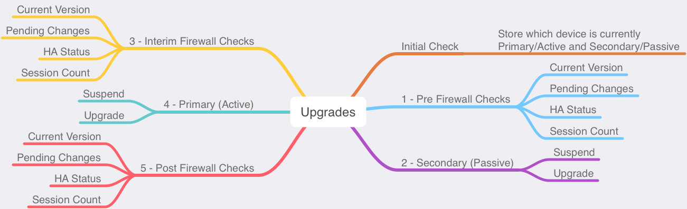

# pan_upgrade
A script to upgrade Palo Alto Networks devices



## Built With

[Docker](https://www.docker.com/products/docker-desktop)  
[Palo Alto Networks PAN-OS SDK for Python](https://github.com/PaloAltoNetworks/pan-os-python)

## Deployment

All files within the folder should be deployed in the same directory for proper file execution.

## Prerequisites

Update `config.py` file with correct values before operating.

```
# CONNECTIVITY CONFIGURATIONS
# Update password with the new password entered during management IP
# configuration. Also, update the firewall_ip section with 2 IP addresses
# for a HA cluster.

paloalto = {
    'username': '<USERNAME>',
    'password': '<PASSWORD>',
    'key': '<API_KEY>',
    'firewall_ip': ['<IP_ADDRESS1>', '<IP_ADDRESS2>']
    }

# PAN-OS VERSION
# Update version with the PAN-OS version the firewall is needed to be
# upgraded to.

version = '<PANOS_VERSION>'
```

## Operating

From the CLI, change directory into the folder containing the files.  The following command will execute the script:

```bash
docker-compose up
```

After the script has completed or if the script needs to be reran, issue the following command:

```bash
docker-compose down --rmi all
```

## Example Output

HA Active/Active firewall pair - [script_output_aa](script_output_aa.md)  
HA Active/Passive firewall pair - [script_output_ap](script_output_ap.md)

## Changelog

See the [CHANGELOG](CHANGELOG) file for details

## License

This project is licensed under the MIT License - see the [LICENSE](LICENSE) file for details
